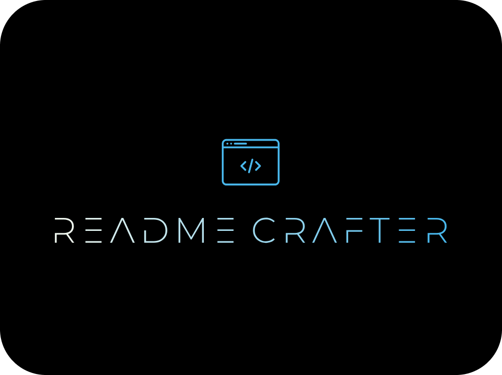

<p align="center">
    
</p>

<p align="center">
    <h1 align="center">Readme-Gen-Frontend</h1>
</p>


<p align="center">
  
  
  
  
  
  
  
  
  
  
  
  
  
  
  
  
  
  
  
</p>
    

<p align="center">
    <em>Constructed using the following tools and technologies:</em>
</p>

<p align="center">
  
  
  
  
  
  
</p>

# Project Overview

README Crafter is a tool designed to automate the generation of README files for GitHub projects. By leveraging the power of the Ollama large language model (LLM), the tool analyzes a project's structure, codebase, and other relevant files to generate comprehensive, professional-grade README documentation. This helps developers quickly create high-quality project overviews without spending excessive time writing detailed documentation manually.

# Key Features:
1. **Automated README Generation:** README Crafter parses the codebase and key project files to generate relevant sections, including project descriptions, installation instructions, usage examples, and contribution guidelines.
2. **LLM-Powered Insights:** The integration with the Ollama LLM enables README Crafter to provide detailed explanations and context for the project, offering both technical clarity and ease of understanding for users and contributors.
3. **GitHub Integration:** The tool seamlessly integrates with GitHub repositories, allowing users to upload their projects and generate customized README files instantly.
4. **Customizable Templates:** README Crafter offers template options, allowing users to choose from various styles and formats depending on their documentation needs.
5. **Continuous Improvement:** Through continuous learning, the LLM can refine its understanding of project structures and programming languages, resulting in more accurate and relevant README content over time.


   # Folder Structure
```sh
Readme-Gen-Frontend/
├── .prettierrc
├── .gitignore
├── README.md
├── package.json
├── lib/
│   ├── constants/
│   │   ├── localStorageNames.ts
│   │   ├── ignoreList.ts
│   │   ├── navLinks.ts
│   │   └── apiEndpoints.tsx
│   ├── context/
│   │   ├── ThemeProviders.tsx
│   │   └── ReduxProvider.tsx
│   ├── hooks/
│   │   ├── useFetchData.ts
│   │   └── useLocalStorage.tsx
│   ├── utils.ts
│   └── utils/
│       └── fileUtils.ts
├── app/
│   ├── main/
│   │   ├── page.tsx
│   │   ├── sections/
│   │   │   ├── KeyFeatureSection/
│   │   │   │   ├── KeyFeatureSection.tsx
│   │   │   │   ├── hooks/
│   │   │   │   │   └── useFetchKeyFeatureData.ts
│   │   │   │   ├── constant.ts
│   │   │   │   └── store/
│   │   │   │       └── keyFeaturesReducer.tsx
│   │   │   ├── ContributorsSection/
│   │   │   │   ├── constants.ts
│   │   │   │   ├── ContributionsSection.tsx
│   │   │   │   ├── hooks/
│   │   │   │   │   └── useFetchContributorsData.ts
│   │   │   │   └── store/
│   │   │   │       └── contributorsReducer.ts
│   │   │   ├── LicenseSection/
│   │   │   │   ├── LicenseSection.tsx
│   │   │   │   ├── hooks/
│   │   │   │   │   └── useFetchLicenseData.ts
│   │   │   │   ├── constant.ts
│   │   │   │   └── store/
│   │   │   │       └── licenseReducer.tsx
│   │   │   ├── SummarySection/
│   │   │   │   ├── types/
│   │   │   │   │   └── index.ts
│   │   │   │   ├── hooks/
│   │   │   │   │   └── useFetchSummaryData.ts
│   │   │   │   ├── constant.ts
│   │   │   │   ├── SummaryGenerationSection.tsx
│   │   │   │   └── store/
│   │   │   │       └── summaryGenerationReducer.tsx
│   │   │   ├── FolderStructureSection/
│   │   │   │   ├── constants.ts
│   │   │   │   ├── types/
│   │   │   │   │   └── index.ts
│   │   │   │   ├── hooks/
│   │   │   │   │   └── useFetchFolderStructureData.ts
│   │   │   │   ├── FolderStructureSection.tsx
│   │   │   │   └── store/
│   │   │   │       ├── folderStructureDictReducer.ts
│   │   │   │       └── folderStructureReducer.ts
│   │   │   ├── ContributingGuideSection/
│   │   │   │   ├── ContributingGuideSection.tsx
│   │   │   │   ├── hooks/
│   │   │   │   │   └── useFetchContributingGuideData.ts
│   │   │   │   ├── constant.ts
│   │   │   │   └── store/
│   │   │   │       └── ContributingGuideReducer.ts
│   │   │   ├── HeaderSection/
│   │   │   │   ├── constants.ts
│   │   │   │   ├── hooks/
│   │   │   │   │   └── useFetchHeaderData.ts
│   │   │   │   ├── HeaderSection.tsx
│   │   │   │   └── store/
│   │   │   │       └── headerReducer.ts
│   │   │   ├── ProjectOverview/
│   │   │   │   ├── constants.ts
│   │   │   │   ├── hooks/
│   │   │   │   │   └── useFetchProjectOverviewData.ts
│   │   │   │   ├── ProjectOverviewSection.tsx
│   │   │   │   └── store/
│   │   │   │       └── projectOverviewReducer.tsx
│   │   │   └── ProjectInstallationGuideSection/
│   │   │       ├── hooks/
│   │   │       │   └── useFetchProjectInstallationGuideData.ts
│   │   │       ├── constant.ts
│   │   │       ├── ProjectInstallationGuideSection.tsx
│   │   │       └── store/
│   │   │           └── projectInstallationGuideReducer.tsx
│   │   └── components/
│   │       ├── SectionHeader.tsx
│   │       └── SectionLayout.tsx
│   ├── layout.tsx
│   ├── favicon.ico
│   ├── store.ts
│   ├── style.js
│   ├── result/
│   │   └── page.tsx
│   ├── globals.css
│   └── (home)/
│       ├── page.tsx
│       ├── hooks/
│       │   └── useRepoData.ts
│       ├── components/
│       │   ├── HomeForm.tsx
│       │   └── PhotoGallery.tsx
│       └── store/
│           └── repoReducer.ts
├── package-lock.json
├── tsconfig.json
├── public/
│   ├── vercel.svg
│   ├── assets/
│   │   ├── README-Crafter - Copy.png
│   │   ├── README-Crafter.png
│   │   └── logo-no-background.webp
│   ├── favicon/
│   │   ├── favicon-32x32.png
│   │   ├── android-chrome-512x512.png
│   │   ├── favicon.ico
│   │   ├── about.txt
│   │   ├── android-chrome-192x192.png
│   │   ├── site.webmanifest
│   │   ├── apple-touch-icon.png
│   │   └── favicon-16x16.png
│   └── Videos/
│       └── First Look.mp4
├── postcss.config.mjs
├── next.config.mjs
├── tailwind.config.ts
└── components/
    ├── MarkdownDownloadButton.tsx
    ├── MarkDownEditor.tsx
    ├── InputField.tsx
    ├── editor.css
    ├── ui/
    │   ├── hero-highlight.tsx
    │   ├── animated-modal.tsx
    │   ├── link-preview.tsx
    │   ├── navbar-menu.tsx
    │   ├── multi-step-loader.tsx
    │   ├── label.tsx
    │   └── input.tsx
    ├── Navbar.tsx
    ├── social-icons/
    │   ├── icons.tsx
    │   └── index.tsx
    ├── ThemeSwitch.tsx
    ├── ActionButton.tsx
    ├── Footer.tsx
    ├── MoveUpFadeAnimation.tsx
    ├── animatedModal.tsx
    ├── Dropdown.tsx
    ├── ScrollToTopButton.tsx
    └── Modals/
        ├── Modals.tsx
        └── store/
            ├── ModalReducer.tsx
            └── BaseUrlReducer.tsx

52 directories, 109 files
```

# Getting Started

## Prerequisites

Before starting with the installation process, ensure that you have the following software and tools installed:

1. **Node.js**: Download the latest version from the official Node.js website: <https://nodejs.org/en/download/>
2. **npm (Node Package Manager)**: This comes bundled with Node.js.
3. **yarn**: Install yarn using npm by running `npm install -g yarn`.
4. **git**: Ensure you have git installed on your system.
5. **README Crafter Flask Server**: Ensure to run this flask server either in local device by cloning it from [GitHub](https://github.com/Eemayas/README-Crafter-Flask-Server) or running on [Google Collab](https://colab.research.google.com/drive/17xqM5mYzgA3jsJ9oyga-j5-GDQuJg56k)
1. **Docker** (optional): If you plan to use Docker for development, ensure it's installed and set up properly.

You can also check out the official documentation for setting up these tools:

* Node.js: <https://nodejs.org/en/docs/>
* yarn: <https://yarnpkg.com/lang/en/docs/install>
* git: <https://git-scm.com/book/en/v2/Getting-Started-Installing-Git>

## Installation

To install the project, follow these steps:

1. **Clone the repository**: Run `git clone https://github.com/Eemayas/Readme-Gen-Frontend.git` in your terminal.
2. **Navigate to the project directory**: Change into the newly cloned project directory using `cd Readme-Gen-Frontend`.
3. **Install dependencies**: Run `yarn install` or `npm install` to fetch all the required packages.
4. **Build the project**: Execute `yarn build` or `npm run build` to compile the project.

## Running the Project

To run the project locally:

1. **Start the development server**: Run `yarn dev` or `npm start` in your terminal.
2. **Open the app**: Visit <http://localhost:3000/> in your browser to see the running application.
3. **Setting up the API point**: If you are running flask server in collab, then place the API endpoint from the collab by clicking the text-button at the bottom of the landing page  


   
# Contributing

Contributions are welcome! Here are several ways you can contribute:

- **[Submit Pull Requests](https://github.com/Eemayas/Readme-Gen-Frontend/pulls)**: Review open PRs, and submit your own PRs.
- **[Join the Discussions](https://github.com/Eemayas/Readme-Gen-Frontend/discussions)**: Share your insights, provide feedback, or ask questions.
- **[Report Issues](https://github.com/Eemayas/Readme-Gen-Frontend/issues)**: Submit bugs found or log feature requests for Readme-Gen-Frontend.

## Contributing Guidelines

1. **Fork the Repository**:
    - Start by forking the project repository to your GitHub account.
2. **Clone the Repository**:
    - Clone your forked repository to your local machine using the command:
    ```sh
    git clone https://github.com/your-username/Readme-Gen-Frontend.git
    ```
    - Replace ``your-username`` with your GitHub username.
3. **Create a New Branch**:
    - Create a new branch for your changes using the command:
    ```sh
    git checkout -b your-branch-name
    ```
4. **Make Your Changes**:
    - Edit, add, or delete files as needed. Ensure your changes align with the project's contribution guidelines.
5. **Commit Your Changes**:
    - Stage your changes and commit them with a descriptive message:
      ```bash
      git add .
      git commit -m "Your descriptive message"
      ```
6. **Push Your Changes:**
    - Push your branch to your forked repository:
      ```bash
      git push origin your-branch-name
      ```
7. **Create a Pull Request (PR):**
    - Go to the original repository on GitHub and click “Compare & pull request.” Provide a clear description of the changes and submit the PR.

Once your PR is reviewed and approved, it will be merged into the main branch.
    

   
# Contributors

| Avatar | Contributor | GitHub Profile | No of Contributions |
|:--------:|:--------------:|:----------------:|:-------------------:|
|  | Eemayas | [@Eemayas](https://github.com/Eemayas) | 31 |

        

   
# License

This project is licensed under the MIT License - see the [LICENSE](./LICENSE) file for details.

